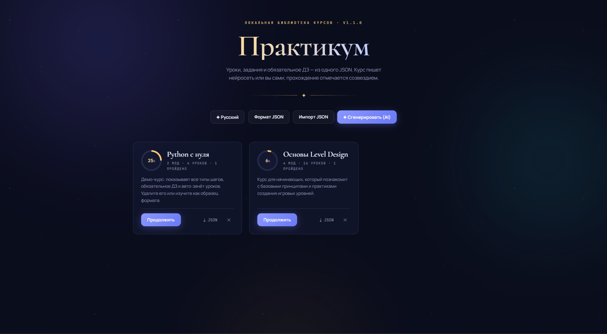
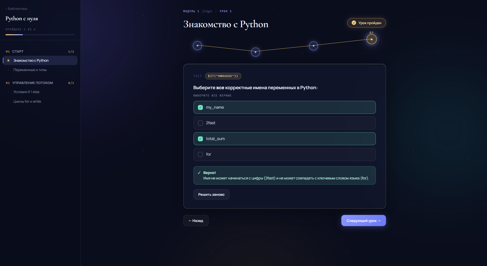
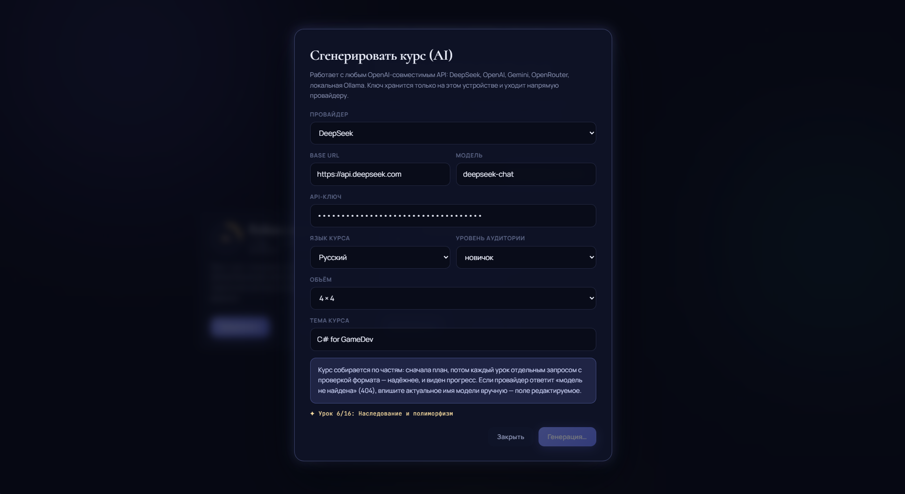

<div align="center">

# ✦ Praktikum · Практикум

**Локальная платформа учебных курсов с генерацией уроков через нейросеть.**
Уроки, задания и обязательное ДЗ — из одного JSON-файла. Работает офлайн.

<!-- Замените ссылки ниже на реальные после первого релиза -->
[Скачать для Windows](../../releases) · [Формат курса](#-формат-курса) · [English](#-english) · [中文](#-中文)



</div>

---

## ✦ Что это

Praktikum — это программа для обучения в стиле Stepik, которая работает целиком
на вашем компьютере. Курсы можно **сгенерировать нейросетью** (по вашему
API-ключу), **написать вручную** в простом JSON или **импортировать** готовые.
Прохождение уроков отмечается автоматически и подсвечивается созвездием шагов.

## ✦ Скриншоты




<details>
<summary>Демо в движении (GIF)</summary>


</details>


## ✦ Возможности

- **Плеер уроков** в стиле Stepik: модули, уроки, пошаговые задания.
- **Три типа шагов:** теория (Markdown с кодом), тест (одиночный/множественный выбор), ответ текстом (точное совпадение / число / вхождение).
- **Обязательное ДЗ** в конце каждого урока — без него урок не засчитывается.
- **Авто-зачёт** урока при прохождении всех шагов + возможность снять отметку вручную.
- **Генерация курсов ИИ** через любой OpenAI-совместимый API: DeepSeek, OpenAI, Gemini, OpenRouter, локальная Ollama. Курс собирается по частям с проверкой формата.
- **Язык интерфейса и курсов:** русский, English, 简体中文.
- **Импорт / экспорт** курсов в JSON, строгая валидация структуры.
- **Локально и приватно:** данные и API-ключ хранятся только на вашем устройстве.

## ✦ Быстрый старт

### Вариант 1 — просто открыть (без установки)
Скачайте `index.html` и откройте его в браузере. Всё работает сразу.
> Для надёжного сохранения прогресса запускайте через локальный сервер:
> `python -m http.server`, затем откройте `http://localhost:8000`.

### Вариант 2 — приложение для Windows
Скачайте портативную сборку из [Releases](../../releases), распакуйте и запустите
`Praktikum.exe`. Установка не требуется.

### Вариант 3 — собрать нативное приложение (Tauri, ~10 МБ)
См. папку [`tauri/`](tauri) и инструкцию в её README.

## ✦ Подключение нейросети

1. Откройте **«✦ Сгенерировать (AI)»**.
2. Выберите провайдера (по умолчанию — DeepSeek) или впишите свой Base URL и модель.
3. Вставьте API-ключ, укажите тему, уровень, объём и язык курса.
4. Нажмите **«Сгенерировать»** — курс появится в библиотеке.

Ключ хранится только локально и отправляется напрямую провайдеру. Пресеты
редактируемы: если имя модели изменится, впишите актуальное вручную.

## ✦ Формат курса

Курс — это один JSON-объект. Минимальный пример:

```json
{
  "title": "Название курса",
  "description": "Короткое описание",
  "modules": [{
    "title": "Модуль 1",
    "lessons": [{
      "title": "Урок 1",
      "steps": [
        { "type": "text", "content": "### Заголовок\nТекст в **Markdown**." },
        { "type": "quiz", "question": "2 + 2 = ?", "options": ["3","4","5"], "correct": [1], "explanation": "Почему так" },
        { "type": "input", "question": "Столица Франции?", "answer": "Париж", "match": "exact" }
      ],
      "homework": [
        { "type": "quiz", "question": "Обязательное ДЗ", "options": ["да","нет"], "correct": [0] }
      ]
    }]
  }]
}
```

| Поле | Описание |
|---|---|
| `type: "text"` | Теория; `content` — Markdown (заголовки, списки, `код`, блоки ` ``` `) |
| `type: "quiz"` | `options` — варианты, `correct` — индексы верных (с нуля), несколько = мультивыбор; `explanation` — пояснение |
| `type: "input"` | `answer` (или `answers[]`), `match`: `exact` / `contains` / `number` (+ `tolerance`) |
| `homework` | Массив шагов quiz/input; обязателен для авто-зачёта урока |

Кнопка **«Формат JSON»** внутри приложения показывает эту же справку.
Готовые курсы можно складывать в папку [`courses/`](courses).

## ✦ Технологии

Чистый HTML/CSS/JS в одном файле, без сборки и зависимостей в рантайме.
Десктоп-версии — обёртки Tauri (Rust) или Electron. Хранение — localStorage.

## ✦ Как помочь проекту

Идеи, баги и правки приветствуются — см. [CONTRIBUTING.md](CONTRIBUTING.md).
Особенно рады улучшениям перевода на 简体中文 и новым курсам в `courses/`.

## ✦ Лицензия

[MIT](LICENSE) — используйте свободно.

---

<a name="-english"></a>

## ✦ English

**Praktikum** is a local, offline learning platform in the spirit of Stepik.
Generate courses with AI (your own API key), write them by hand in simple JSON,
or import ready-made ones. Lesson progress is tracked automatically and lights
up as a constellation.

**Features:** Stepik-style lesson player · three step types (theory / quiz /
text answer) · mandatory homework per lesson · auto-completion · AI generation
via any OpenAI-compatible API (DeepSeek, OpenAI, Gemini, OpenRouter, Ollama) ·
UI & course languages: Russian, English, Simplified Chinese · JSON import/export
with validation · fully local and private.

**Quick start:** download `index.html` and open it in a browser, or grab the
portable Windows build from [Releases](../../releases). To connect AI, open
"Generate (AI)", pick a provider, paste your API key, and describe the course.

---

<a name="-中文"></a>

## ✦ 中文

**Praktikum（实践场）** 是一款本地离线学习平台，风格类似 Stepik。
课程可以用 AI 生成（使用你自己的 API 密钥）、手动编写为简单的 JSON 文件，
或直接导入现成课程。学习进度自动记录，并以点亮的星座呈现。

**功能特性：**
- Stepik 风格的课程播放器：模块 → 课 → 分步练习
- 三种步骤类型：理论（Markdown，支持代码块）· 测验（单选/多选）· 文本作答（精确 / 数字 / 包含匹配）
- 每课末尾的**必做作业** —— 未完成则本课不会自动判定通过
- 课程自动判定完成，也可手动取消标记
- **AI 生成课程**：兼容任意 OpenAI 格式的 API —— DeepSeek、OpenAI、Gemini、OpenRouter、本地 Ollama。课程分步生成并逐课校验格式
- 界面与课程语言：русский、English、简体中文
- JSON 课程导入 / 导出，带严格的结构校验
- **完全本地、注重隐私**：数据与 API 密钥仅保存在你的设备上

**快速开始：** 下载 `index.html` 并在浏览器中打开即可使用；
或从 [Releases](../../releases) 获取 Windows 便携版 —— 解压后运行
`Praktikum.exe`，无需安装。

**接入 AI：** 打开「✦ 生成（AI）」→ 选择服务商（默认 DeepSeek）→
粘贴 API 密钥 → 填写课程主题、受众水平与课程语言 → 点击「生成」。
密钥仅保存在本地，并直接发送给服务商。

**课程格式** 见 [上方说明](#-формат-курса)，应用内的「JSON 格式」按钮
也提供同样的示例。欢迎为 `courses/` 目录贡献中文课程，
也欢迎改进中文翻译 —— 详见 [CONTRIBUTING.md](CONTRIBUTING.md)。

基于 [MIT](LICENSE) 许可证发布。

Licensed under [MIT](LICENSE).
